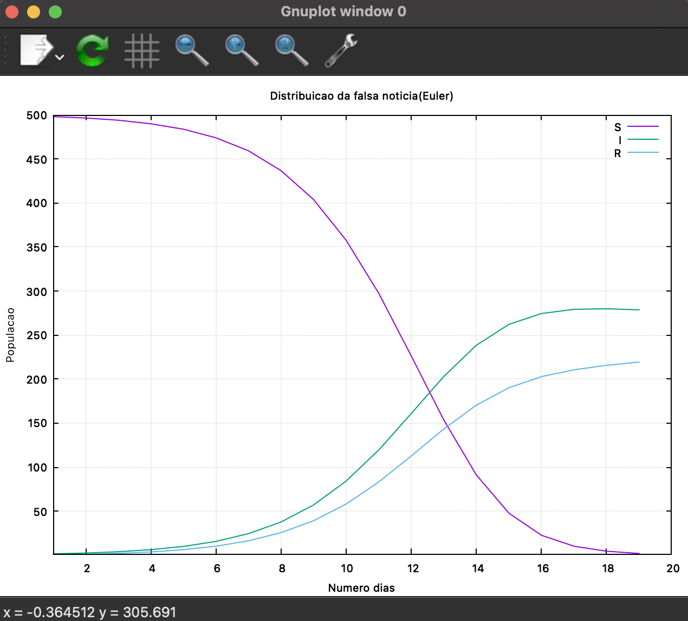

# Epidemiological Simulation with Numerical Methods

This project implements an epidemiological simulator using the SEIR model (Susceptible-Exposed-Infectious-Recovered) with differential equations. It offers two numerical integration methods: Euler's Method and 4th order Runge-Kutta Method (RK4).

## Screenshots

### Application Menu


### Example Simulation Graph


## Requirements

- Java Development Kit (JDK) 8 or higher
- Gnuplot (for graph generation)

### Installing Gnuplot

**macOS** (using Homebrew):
```bash
brew install gnuplot
```

**Linux**:
```bash
sudo apt-get install gnuplot    # Ubuntu/Debian
sudo dnf install gnuplot        # Fedora
```

**Windows**: Download from [gnuplot.info](http://www.gnuplot.info/download.html)

## Building and Running

### 1. Compile the project

```bash
cd src
javac *.java
```

### 2. Run in Interactive Mode

```bash
java Main
```

The program will prompt you to:
- Select integration method (1 for Euler, 2 for RK4)
- Provide input CSV file name (e.g., `entrada.csv`)
- Define integration step (value between 0 and 1)
- Specify population size
- Set number of days for simulation
- Choose which parameter sets to analyze

### 3. Run in Command Line Mode

```bash
java Main entrada.csv -m 2 -p 0.1 -t 1000000 -d 365 output
```

Parameters:
- `entrada.csv`: Input file with epidemiological parameters
- `-m`: Method (1=Euler, 2=RK4)
- `-p`: Integration step (0 to 1)
- `-t`: Population size
- `-d`: Number of days
- `output`: Output file name (without .csv extension)

## Input File Format

A sample input file `entrada.csv` is included. Format:

```csv
Name,beta,gamma,ro,alpha
Person1,0.5,0.1,0.15,0.2
Person2,0.7,0.2,0.1,0.3
```

Parameters:
- `beta`: Transmission rate
- `gamma`: Recovery rate
- `ro`: Exposure rate
- `alpha`: Incubation rate

## Output Files

All generated files are saved in the `src/outputs/` directory:
- **CSV files**: Simulation results with daily population data
- **GP files**: Gnuplot scripts
- **PNG files**: Generated graphs (in non-interactive mode)

In interactive mode, graphs open automatically. You can also view them manually:
```bash
gnuplot -persist src/outputs/filename.gp
```

## SEIR Model

The simulation uses these differential equations:

- dS/dt = -β × S × I / N
- dE/dt = β × S × I / N - α × E
- dI/dt = α × E - γ × I
- dR/dt = γ × I

Where S=Susceptible, E=Exposed, I=Infectious, R=Recovered, N=Total population.

## Project Structure

- `Main.java`: Program entry point and user interface
- `Calculos.java`: Numerical integration methods (Euler and RK4)
- `OperacaoFicheiros.java`: File I/O operations
- `Gnuplot.java`: Graph generation
- `Validacoes.java`: Input validation
